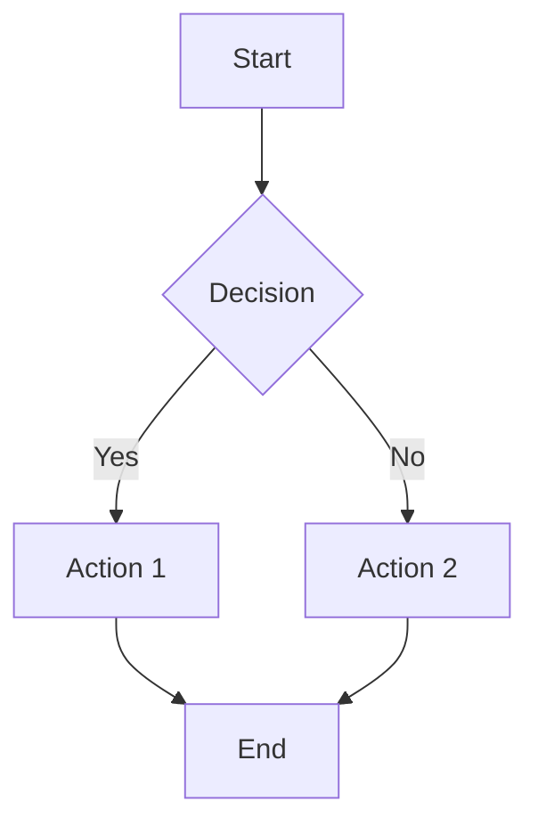
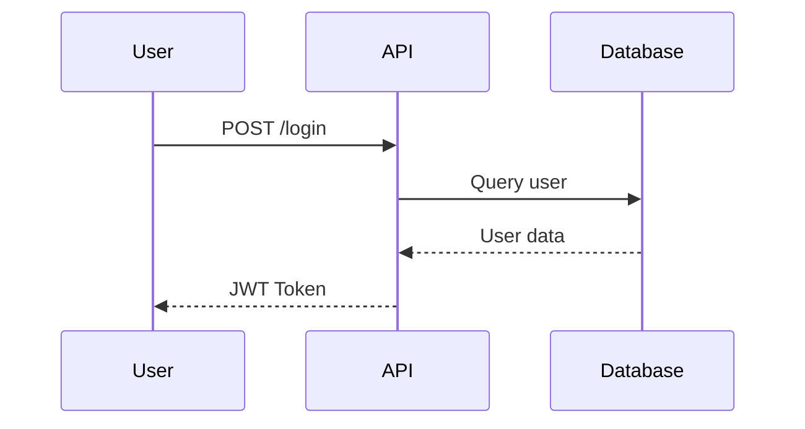
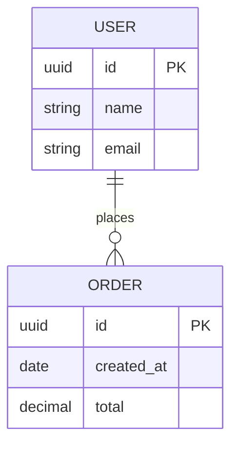

# Markdown (MD) Skill

## Overview
Markdown is a lightweight markup language for creating formatted text. This skill follows the **CommonMark** specification and **GitHub Flavored Markdown (GFM)** extensions as the global standard.

**References**:
- [CommonMark Specification](https://spec.commonmark.org/)
- [GitHub Flavored Markdown Spec](https://github.github.com/gfm/)

## Core Syntax

### Headings
```markdown
# Heading 1 (H1) — Page title, use only ONE per document
## Heading 2 (H2) — Major sections
### Heading 3 (H3) — Subsections
#### Heading 4 (H4) — Sub-subsections
##### Heading 5 (H5) — Rarely used
###### Heading 6 (H6) — Rarely used

<!-- ✅ BEST PRACTICE: Use ATX-style headings (# prefix) -->
<!-- ❌ AVOID: Setext-style headings (underline with === or ---) -->

<!-- ✅ Always add blank line before and after headings -->
<!-- ✅ Use sentence case or title case consistently -->
<!-- ✅ Don't skip levels (e.g., H1 → H3 without H2) -->
```

### Emphasis & Formatting
```markdown
*italic text*           <!-- or _italic text_ -->
**bold text**           <!-- or __bold text__ -->
***bold italic***       <!-- or ___bold italic___ -->
~~strikethrough~~       <!-- GFM extension -->
`inline code`
<sub>subscript</sub>    <!-- HTML in Markdown -->
<sup>superscript</sup>  <!-- HTML in Markdown -->
<kbd>Ctrl</kbd> + <kbd>C</kbd>  <!-- Keyboard keys -->
<mark>highlighted</mark>        <!-- Highlighted text -->
```

### Paragraphs & Line Breaks
```markdown
This is a paragraph. Leave a blank line between paragraphs.

This is the next paragraph.

For a line break within a paragraph,  
end a line with two spaces (or use <br>).

<!-- ✅ Always use blank lines to separate block elements -->
```

### Horizontal Rules
```markdown
---
***
___

<!-- Use --- as the standard separator -->
<!-- Always leave blank line before and after -->
```

## Lists

### Unordered Lists
```markdown
- Item one
- Item two
  - Nested item 2a
  - Nested item 2b
    - Deep nested item
- Item three

<!-- ✅ Use - (dash) consistently -->
<!-- ❌ Avoid mixing -, *, + markers -->
<!-- ✅ Use 2-space indent for nesting -->
```

### Ordered Lists
```markdown
1. First item
2. Second item
   1. Nested ordered item
   2. Another nested item
3. Third item

<!-- Markdown auto-numbers, so you can use: -->
1. First
1. Second (still renders as "2.")
1. Third  (still renders as "3.")
```

### Task Lists (GFM)
```markdown
- [x] Completed task
- [ ] Incomplete task
- [ ] Another task
  - [x] Subtask completed
  - [ ] Subtask pending
```

### Definition Lists (Extended)
```markdown
<!-- Supported by some parsers (PHP Markdown Extra, Pandoc) -->
Term 1
: Definition of term 1

Term 2
: Definition of term 2
: Alternative definition
```

## Links & Images

### Links
```markdown
<!-- Inline link -->
[Link text](https://example.com)
[Link with title](https://example.com "Hover title")

<!-- Reference link (recommended for repeated URLs) -->
[Link text][ref-id]
[Another link][ref-id]

[ref-id]: https://example.com "Optional title"

<!-- Autolink -->
<https://example.com>
<email@example.com>

<!-- Section link (anchor) -->
[Jump to section](#section-heading)

<!-- Relative link to file -->
[Contributing Guide](./CONTRIBUTING.md)
[API Docs](../docs/api.md)
```

### Images
```markdown
<!-- Inline image -->


<!-- Reference image -->
![Alt text][img-ref]

[img-ref]: image.png "Optional title"

<!-- Image with link -->
[](https://example.com)

<!-- ✅ Always provide meaningful alt text for accessibility -->
```

## Code

### Inline Code
```markdown
Use `console.log()` for debugging.
Install with `npm install express`.
```

### Fenced Code Blocks
````markdown
```javascript
function greet(name) {
  return `Hello, ${name}!`;
}
```

```python
def greet(name: str) -> str:
    return f"Hello, {name}!"
```

```bash
npm install
npm run dev
```

```sql
SELECT u.name, COUNT(o.id) AS order_count
FROM users u
LEFT JOIN orders o ON u.id = o.user_id
GROUP BY u.name
ORDER BY order_count DESC;
```

<!-- ✅ Always specify the language for syntax highlighting -->
<!-- Common languages: javascript, typescript, python, bash, sql,
     json, yaml, html, css, java, go, rust, php, ruby, c, cpp -->
````

### Diff Block
````markdown
```diff
- const OLD_VALUE = "removed";
+ const NEW_VALUE = "added";
  const UNCHANGED = "same";
```
````

## Tables (GFM)

```markdown
| Column 1 | Column 2 | Column 3 |
|----------|----------|----------|
| Row 1    | Data     | Data     |
| Row 2    | Data     | Data     |
| Row 3    | Data     | Data     |

<!-- Alignment -->
| Left     | Center   | Right    |
|:---------|:--------:|---------:|
| Left     | Center   | Right    |
| aligned  | aligned  | aligned  |

<!-- ✅ Use pipes consistently -->
<!-- ✅ Header row is required -->
<!-- ✅ Minimum 3 dashes per column -->
```

## Blockquotes

```markdown
> This is a blockquote.
>
> It can span multiple paragraphs.

> Nested blockquotes:
>> Second level
>>> Third level

<!-- Callouts (GitHub-specific) -->
> [!NOTE]
> Highlights information that users should take into account.

> [!TIP]
> Optional information to help a user be more successful.

> [!IMPORTANT]
> Crucial information necessary for users to succeed.

> [!WARNING]
> Critical content demanding immediate user attention due to potential risks.

> [!CAUTION]
> Negative potential consequences of an action.
```

## Extended Features

### Footnotes (GFM)
```markdown
This statement needs a citation[^1].
Another reference[^note].

[^1]: This is the footnote content.
[^note]: Footnotes can have any identifier.
    They can span multiple lines with indentation.
```

### Math (LaTeX — GitHub, GitLab)
```markdown
<!-- Inline math -->
The equation $E = mc^2$ is famous.

<!-- Block math -->
$$
\sum_{i=1}^{n} x_i = x_1 + x_2 + \cdots + x_n
$$
```

### Mermaid Diagrams (GitHub, GitLab)
````markdown





````

### Collapsed Sections (HTML in GFM)
```markdown
<details>
<summary>Click to expand</summary>

This content is hidden by default.

- Item 1
- Item 2
- Item 3

</details>
```

### Emoji
```markdown
<!-- GitHub shortcodes -->
:rocket: :star: :white_check_mark: :warning: :x: :bulb:
:book: :gear: :lock: :fire: :bug: :memo:

<!-- Unicode emoji also supported -->
🚀 ⭐ ✅ ⚠️ ❌ 💡
```

## Document Templates

### README.md Template
```markdown
# Project Name

[](https://github.com/user/repo/actions)
[](LICENSE)
[](https://github.com/user/repo/releases)

> Brief one-line description of what this project does.

## Features

- ✅ Feature one
- ✅ Feature two
- ✅ Feature three

## Prerequisites

- Node.js >= 20
- npm >= 10
- PostgreSQL >= 16

## Installation

\```bash
# Clone the repository
git clone https://github.com/user/repo.git
cd repo

# Install dependencies
npm install

# Configure environment
cp .env.example .env

# Run migrations
npm run db:migrate

# Start development server
npm run dev
\```

## Usage

\```bash
# Development
npm run dev

# Production build
npm run build
npm start

# Run tests
npm test
\```

## API Documentation

See [API Documentation](./docs/api.md) for detailed endpoint information.

## Contributing

Please read [CONTRIBUTING.md](./CONTRIBUTING.md) for details on our code of conduct and the process for submitting pull requests.

## License

This project is licensed under the MIT License — see the [LICENSE](LICENSE) file for details.

## Acknowledgments

- Acknowledgment 1
- Acknowledgment 2
```

### CHANGELOG.md Template (Keep a Changelog)
```markdown
# Changelog

All notable changes to this project will be documented in this file.

The format is based on [Keep a Changelog](https://keepachangelog.com/en/1.1.0/),
and this project adheres to [Semantic Versioning](https://semver.org/spec/v2.0.0.html).

## [Unreleased]

### Added
- New feature description

### Changed
- Changed feature description

### Deprecated
- Feature that will be removed

### Removed
- Removed feature

### Fixed
- Bug fix description

### Security
- Security fix description

## [1.1.0] - 2026-02-19

### Added
- User authentication with JWT
- Rate limiting middleware

### Fixed
- Fix memory leak in WebSocket handler

## [1.0.0] - 2026-01-15

### Added
- Initial release
- Core API endpoints
- Database schema
- Docker support

[Unreleased]: https://github.com/user/repo/compare/v1.1.0...HEAD
[1.1.0]: https://github.com/user/repo/compare/v1.0.0...v1.1.0
[1.0.0]: https://github.com/user/repo/releases/tag/v1.0.0
```

### CONTRIBUTING.md Template
```markdown
# Contributing to Project Name

## How to Contribute

1. Fork the repository
2. Create a feature branch (`git checkout -b feature/amazing-feature`)
3. Commit your changes (`git commit -m 'feat: add amazing feature'`)
4. Push to the branch (`git push origin feature/amazing-feature`)
5. Open a Pull Request

## Development Setup

\```bash
npm install
npm run dev
\```

## Coding Standards

- Follow the existing code style
- Write meaningful commit messages using [Conventional Commits](https://www.conventionalcommits.org/)
- Add tests for new features
- Update documentation as needed

## Pull Request Process

1. Update the README.md with details of changes if applicable
2. Update the CHANGELOG.md under [Unreleased]
3. The PR will be merged once reviewed and approved

## Code of Conduct

This project follows the [Contributor Covenant](https://www.contributor-covenant.org/) code of conduct.
```

### Architecture Decision Record (ADR)
```markdown
# ADR-001: Use PostgreSQL as Primary Database

## Status

Accepted

## Context

We need to choose a primary database for storing user data, transactions, and application state. The system requires ACID compliance, complex queries, and JSON support.

## Decision

We will use PostgreSQL 16 as our primary database.

## Consequences

### Positive
- Full ACID compliance
- Excellent JSON/JSONB support
- Mature ecosystem and tooling
- Strong community support

### Negative
- Requires more operational expertise than SQLite
- Horizontal scaling requires additional tools (Citus, read replicas)

## Alternatives Considered

1. **MySQL** — Less feature-rich, weaker JSON support
2. **MongoDB** — No ACID in multi-document transactions (initially)
3. **SQLite** — Not suitable for concurrent multi-user access
```

## Best Practices

| Practice | Description |
|----------|-------------|
| **Single H1** | Use only one `#` heading per document |
| **Heading hierarchy** | Never skip levels (H1 → H3 without H2) |
| **Blank lines** | Always surround block elements with blank lines |
| **Alt text** | Always provide alt text for images |
| **Reference links** | Use reference-style for repeated URLs |
| **Language tag** | Always specify language in fenced code blocks |
| **Line length** | Keep lines under 120 characters (optional but helpful) |
| **UTF-8** | Always use UTF-8 encoding |
| **Trailing newline** | End files with a single newline |
| **No trailing spaces** | Clean trailing whitespace (except for intentional `<br>`) |
| **Consistent markers** | Use `-` for unordered lists, `---` for horizontal rules |
| **Sentence per line** | Consider one sentence per line for better diffs |

## Linting
```bash
# Install markdownlint
npm install -g markdownlint-cli

# Lint files
markdownlint "**/*.md"
markdownlint --fix "**/*.md"

# .markdownlint.json configuration
{
  "default": true,
  "MD013": { "line_length": 120 },
  "MD033": { "allowed_elements": ["details", "summary", "sub", "sup", "kbd", "mark", "br"] },
  "MD041": true
}

# .markdownlint-cli2.jsonc
{
  "config": {
    "default": true,
    "MD013": false
  },
  "globs": ["**/*.md"],
  "ignores": ["node_modules", "vendor"]
}
```

## File Naming Conventions
```
# Standard files (UPPERCASE)
README.md
CHANGELOG.md
CONTRIBUTING.md
CODE_OF_CONDUCT.md
LICENSE.md
SECURITY.md

# Documentation files (lowercase with dashes)
docs/getting-started.md
docs/api-reference.md
docs/deployment-guide.md
docs/architecture-decision-records/adr-001.md

# Extension
.md                    # Standard extension (preferred)
.markdown              # Alternative (less common)
```

## Rules Integration
- **Accessibility**: Always provide alt text for images, use proper heading hierarchy
- **SEO**: Use descriptive link text (avoid "click here"), provide meaningful headings
- **Version Control**: Markdown diffs are clean when using one sentence per line
- **Documentation**: Keep docs close to code, update with code changes
- **Encoding**: Always UTF-8, never use BOM
